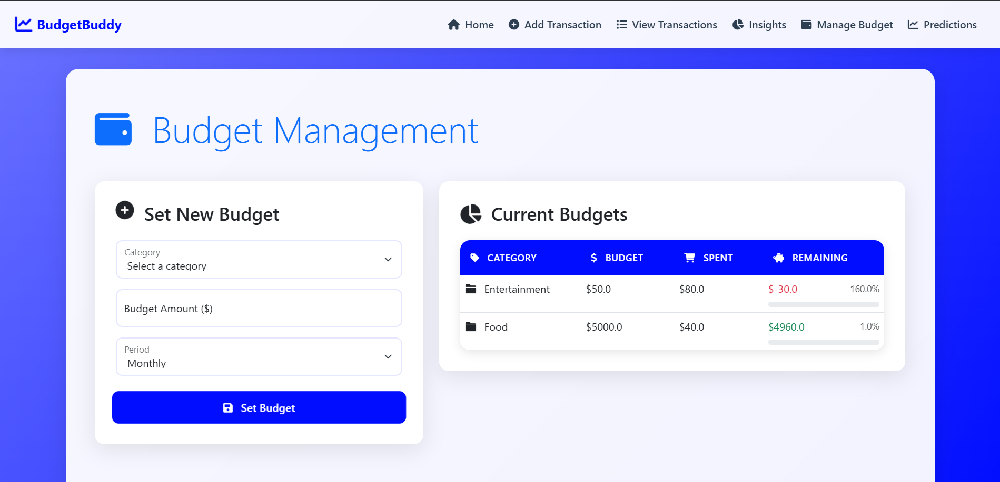

# **BudgetBuddy**

## **Overview**

The **BudgetBuddy** is a comprehensive web application designed to help individuals and small businesses seamlessly manage their finances. With a user-friendly interface and powerful tools, it simplifies the process of tracking income, expenses, and budgets, empowering users to make informed financial decisions.

This project utilizes a robust technology stack, ensuring performance, scalability, and security while providing essential features for everyday financial management.

---

## **Features**

### **User Authentication**
- Secure login and registration system to protect user data.
- Session management to ensure privacy and data integrity.

### **Transaction Management**
- Add detailed transactions with descriptions, amounts, dates, categories, payment methods, and notes.
- Categorize expenses and incomes into predefined or custom categories.

### **Budget Management**
- Set budgets for specific categories to track spending effectively.
- Real-time updates on budget utilization to prevent overspending.

### **View Transactions**
- Search and filter transactions by category, date, amount, or keyword.
- Export transaction data in CSV or PDF formats for offline use.

### **Financial Summaries**
- Detailed financial reports, including:
  - Total income and expenses.
  - Remaining balance.
  - Top spending categories and average daily expenses.
- Visual charts to analyze spending habits and income trends.

### **Import Transactions**
- Upload transaction data from CSV or Excel files for seamless integration of historical data.

### **Error Handling**
- Informative and user-friendly error messages for a smooth user experience.

---
## **Screenshots of UI**
## Screenshots

### welcome View

### register View

### login View

### Dashboard View

### Add Transaction Page

### View Transactions View

### Insights View

### Manage Budget View

### prediction View

## **Technology Stack**

### **Backend**
- Python (Flask Framework): A lightweight and flexible web framework for backend development.

### **Database**
- MongoDB: A NoSQL database for efficient and scalable data management.

### **Frontend**
- HTML, CSS, and Jinja2: For building responsive and dynamic web pages.

### **Libraries and Tools**
- **Pandas**: For efficient data processing and manipulation.
- **WeasyPrint**: For generating PDF exports.
- **Werkzeug**: For password hashing and secure file uploads.
- **Bootstrap**: For a modern, responsive design.

---

## **Future Enhancements**

- **AI-Powered Insights**: Leverage AI/ML to provide personalized financial insights and recommendations.
- **Recurring Transactions**: Automate recurring income and expenses for better tracking.
- **Multi-Currency Support**: Enable global users to manage finances in multiple currencies.
- **Mobile Application**: Develop a mobile app for on-the-go access.

---

## **Contributing**

We welcome contributions to make **Finance Manager** even better!  
Feel free to fork the repository, create feature branches, and submit pull requests. Please ensure your contributions adhere to the existing coding standards and include proper documentation.

---

## **License**

This project is licensed under the [MIT License](LICENSE).

---

## **Acknowledgments**

- [Flask](https://flask.palletsprojects.com/) for its simplicity and versatility.  
- [MongoDB](https://www.mongodb.com/) for providing a powerful NoSQL database solution.  
- [Bootstrap](https://getbootstrap.com/) for helping create a responsive and modern UI.  
- The open-source community for providing countless resources and support.

